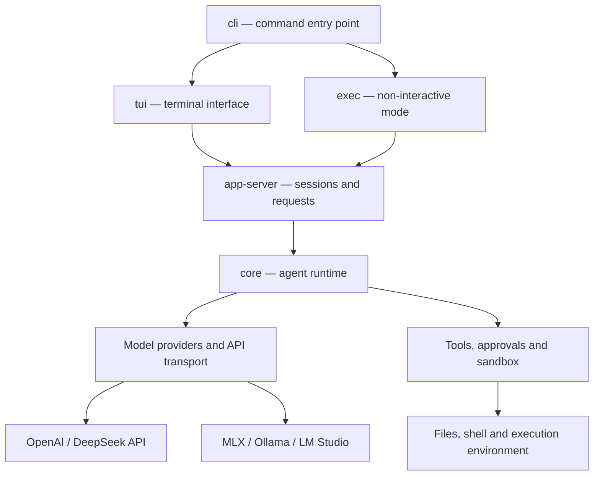

# Evo Codex

Evo Codex is a Rust fork of Codex CLI with native OpenAI, DeepSeek API, and local model selection from `/model`. DeepSeek metadata is compiled into Rust: no `models.json`, Node proxy, or JavaScript launcher is required.

## Build and run

On macOS or Linux, launch from the repository root:

```sh
./run_prod.sh
```

The launcher uses the existing release binary, building it with Rust/Cargo if it is missing. It does not require Node.js or Python. Install Rust using rustup and the platform's native build tools if a build is needed. After changing Rust sources, run `./run_prod.sh --rebuild` to rebuild and launch. Builds default to two parallel jobs; set `CARGO_BUILD_JOBS` to override this.

Source builds start with `--no-daemon`, using the embedded app server. The shared background daemon requires a complete CLI package, which `cargo build` alone does not produce. The daemon-wide `agents` overview therefore requires a packaged installation. Explicit `--remote` connections are forwarded without adding `--no-daemon`; set `EVO_CODEX_USE_SHARED_SERVER=1` to opt into shared-server startup once the required package is installed.

All other arguments are forwarded to Codex, and the caller's working directory is preserved:

```sh
./run_prod.sh --help
./run_prod.sh -C /path/to/your/project
./run_prod.sh -c model_provider='"deepseek"' -m deepseek-flash
```

DeepSeek API requires `DEEPSEEK_API_KEY` in your environment. Once the terminal interface opens, use `/model` to select a provider and model. MLX checkpoints can be discovered and downloaded before the inference server starts; other local providers require a running compatible server.

To build and run manually:

```sh
cd codex-rs
cargo build --release --locked -p codex-cli
./target/release/codex --no-daemon
```

Use this binary, not an upstream npm or Homebrew installation: upstream Codex does not include these changes. The CLI, terminal interface, provider integration, HTTP streaming, and local model discovery run in Rust. `just fmt`, `just fix`, and `just test` also run without a Python launcher.

The repository retains upstream SDKs, development scripts, generated protocol bindings, and optional JavaScript-based tools for compatibility. It is **not a repository containing exclusively Rust source**. Deleting those files would remove functionality or break upstream development workflows. External MCP servers and plugins may have their own runtime requirements. These are not dependencies of the native DeepSeek integration.

## OpenAI

Launch the binary and sign in as usual. `/model` → **OpenAI** retains account-scoped model discovery and the existing model/reasoning picker. Model availability still depends on your account and provider. The integration does not replace OpenAI's catalog with a DeepSeek catalog.

## DeepSeek API

Set the API key in the environment before launching Evo Codex:

```sh
export DEEPSEEK_API_KEY='your-deepseek-api-key'
./run_prod.sh
```

Open `/model` → **DeepSeek API**, then select a model and reasoning effort. The native Responses catalog includes `deepseek-flash` and `deepseek-v4-pro`, with `low`, `high`, and `max` reasoning. Flash accepts image input; V4 Pro is text-only. DeepSeek requests use `https://api.deepseek.com/responses` and separate DeepSeek credentials.

You can also start directly without logging into OpenAI:

```sh
./run_prod.sh -c model_provider='"deepseek"' -m deepseek-flash
```

For a persistent default, add these entries to your Codex `config.toml`:

```toml
model_provider = "deepseek"
model = "deepseek-flash"
model_reasoning_effort = "high"
```

No provider block or custom JSON catalog is needed. Existing explicit DeepSeek provider definitions remain supported, including custom endpoints and bearer tokens. Prefer the environment variable for credentials. An explicitly configured `model_catalog_json` remains authoritative; remove a stale DeepSeek-only catalog if you want native catalogs when switching providers.

## Local DeepSeek and custom models

For Ollama and LM Studio, start the inference server, load your model, then choose `/model` → **Local · Ollama** or **Local · LM Studio**. Evo Codex queries `/v1/models` and uses the exact returned model IDs. It does not filter out uncensored models or custom fine-tunes. Manage downloads for these two providers in their respective applications.

### MLX checkpoints and automatic downloads

On Apple Silicon, choose `/model` → **Local · MLX / Qwen**. The catalog includes complete checkpoints found in `~/Documents/Model`, even with the server stopped, plus these built-in downloads:

| Checkpoint | Download | Minimum installed RAM |
| --- | --- | --- |
| Qwen3.5-2B-4bit | 1.6 GiB | 4 GiB |
| Qwen3.5-4B-4bit | 2.9 GiB | 6 GiB |
| Qwen3.8-27B-Uncensored-MLX-4bit | 15.0 GiB | 20 GiB |
| Qwen3.8-27B-Uncensored-MLX-6bit | 21.2 GiB | 32 GiB |
| Qwen3.8-27B-Uncensored-MLX-8bit | 27.5 GiB | 40 GiB |

Select a checkpoint to verify existing files or automatically download missing files from Hugging Face. Opening the catalog does not download weights. The progress view supports cancellation with Escape and resumption on the next selection. Downloads use pinned revisions, verify file sizes and SHA-256 hashes, check available disk space, and publish each file only after verification. Corrupt existing files are reported without being overwritten. Partial checkpoints are excluded from installed-model discovery. Minimum RAM is an admission check, not a guarantee of sufficient free memory; context length and other applications also consume memory.

The Rust integration reuses an **already installed external MLX-VLM runtime**, such as the environment used by `qwen-tui`. It looks for `~/Documents/Model/.venv/bin/python`; this engine itself is Python/MLX, not Rust. The catalog, downloader, process lifecycle, model picker, and telemetry are implemented in Rust. No new Python or Node integration scripts are required. The runtime must support streaming `/v1/responses` and function tools; a Chat Completions-only server is insufficient.

The built-in MLX provider uses `http://127.0.0.1:8080/v1`. When the loopback server is stopped, Evo Codex starts the installed runtime on the first API request and loads the selected checkpoint on demand. It only stops the child process it owns; a server started separately is left running. Automatic startup uses offline model loading, a 32,768-token KV limit, and one concurrent generation. Models are downloaded through the explicit picker selection, not implicitly by the inference engine.

Optional environment settings:

| Variable | Purpose |
| --- | --- |
| `CODEX_MLX_MODEL_DIR` | Checkpoint directory; defaults to `QWEN_HOME`, then `~/Documents/Model` |
| `CODEX_MLX_PYTHON` | Existing MLX-VLM Python executable |
| `CODEX_MLX_BASE_URL` | Server endpoint; takes precedence over `QWEN_API_URL` |
| `QWEN_API_KEY` | Optional MLX server bearer token |
| `CODEX_MLX_AUTO_START=0` | Require a separately started server |

Disk discovery and the built-in download catalog apply to loopback MLX endpoints. Remote MLX endpoints expose their own served catalog. GGUF files are not MLX checkpoints; use an appropriate Ollama or LM Studio backend for those files. MLX on this Mac uses Apple Silicon/Metal. CPU and CUDA execution require a backend and model format that support them.

Default endpoints:

| Provider | Base URL |
| --- | --- |
| Ollama | `http://localhost:11434/v1` |
| LM Studio | `http://localhost:1234/v1` |
| MLX / Qwen | `http://127.0.0.1:8080/v1` |

The inference server controls hardware acceleration. Ollama supports CPU execution, CUDA on compatible NVIDIA GPUs, and Metal on supported Apple GPUs. Evo Codex uses the same Rust HTTP client for all three; it does not embed an inference engine or select GPU devices itself. Configure the server for your hardware and choose a model that fits its available RAM/VRAM. See [Ollama hardware support](https://docs.ollama.com/gpu) and [LM Studio system requirements](https://lmstudio.ai/docs/app/system-requirements). These hardware configurations have not been tested as part of this integration.

For a different local server or port, set `CODEX_OSS_BASE_URL` before starting the CLI. This overrides the endpoint for both local choices; select one consistently:

```sh
export CODEX_OSS_BASE_URL='http://localhost:8080/v1'
./run_prod.sh --oss --local-provider ollama -m 'your-exact-model-id'
```

The server must implement **Responses API streaming and function tool calls**, in addition to `/v1/models`. A server that only implements `/v1/chat/completions` is not compatible with this transport. A model appearing in the catalog does not prove it can execute agent tools. Use a model and server combination with working tool calling.

Local metadata defaults to text input, direct function tools, no reasoning summary parameter, and a 32,768-token context estimate. MLX discovery lowers this estimate when the server's `/health` response reports a smaller configured context limit. Set `model_context_window` to the actual context configured on other servers, particularly when it is smaller. For local memory processing, explicitly set `[memories].extract_model` and `[memories].consolidation_model` to locally available IDs.

Discovery has a five-second deadline and a one-MiB response limit. Unreachable servers and invalid catalogs produce errors in the picker instead of blocking it indefinitely. Closing the picker discards late replies.

### Local latency and model behavior

Time to first text includes loading and prompt processing; it is different from generation tokens per second. Codex supplies agent instructions, tools, workspace instructions, and task history, so a short user question can still produce a large model input. In measured M5/27B tests, Chat Completions and Responses both generated about 7 tokens/s with short prompts, while an uncached 24,726-token Codex request spent about 130 seconds processing its input. Metal was active during inference.

Prefix caching helped repeated inputs around 8,700 tokens, but the tested 2 GiB cache budget could not retain the approximately 24,400-token case. It should not be enabled with unbounded memory or advertised as a universal fix. See [local model performance verification](LOCAL_MODEL_PERFORMANCE.md) for measured cold/warm results, cache limits, reproducible Rust benchmarks, and the distinction between model-generated refusals and tool permissions.

## Hardware panel

`run_prod.sh` enables the full-screen transcript and a right-side hardware panel when the terminal is at least 110 columns wide and 16 rows tall. It shows system-wide CPU usage, used/total RAM, GPU usage, and available CPU/GPU temperature sensors. Sampling runs outside the UI event loop, with command timeouts, and stops when the application exits.

On macOS, CPU/RAM readings come from native system tools and Apple GPU utilization comes from the graphics driver. CPU/GPU temperatures are read directly from AppleSMC through Rust IOKit bindings, without `sudo` or an external sensor utility. Each temperature is the hottest valid reading among the discovered sensors for that component. Sensor discovery is cached for the monitor's lifetime; synchronous driver reads run on a blocking worker, outside the UI event loop. Unsupported, inaccessible, or invalid sensors show `N/A`. On Linux, CPU/RAM use `/proc`; NVIDIA GPU utilization/temperature use `nvidia-smi`, and supported CPU thermal zones use sysfs. Other unavailable counters also show `N/A`, never a fabricated zero. These are whole-machine measurements, not per-model utilization.

Set `EVO_CODEX_HARDWARE_PANEL=0` to disable telemetry and the launcher's full-screen default. For direct binary launches, enable the panel layout with `-c tui.fullscreen_transcript=true`. Narrow terminals and inline transcript mode retain the existing chat layout.

## Switching and feature compatibility

Selecting another model of the current provider updates the current task. Switching providers starts a fresh task and preserves the previous task for `/resume`; it does not silently transmit that task's conversation to the new provider. The current app-server protocol does not support changing a live task's provider. Provider selection is available with the embedded local app server; remote app-server sessions retain their server-side model configuration.

Shell execution, file editing, approvals, sandboxing, skills, and MCP remain part of the Codex agent runtime. Tool-call quality and supported modalities depend on the selected model. DeepSeek and local providers do not advertise OpenAI-hosted web search, image generation, namespaces, or remote compaction. Local compaction remains available. JavaScript REPL tools are disabled in the native DeepSeek/local model metadata; optional OpenAI workflows remain intact.

## Architecture and crate responsibilities

`codex-rs` is a Cargo workspace containing multiple Rust crates. The workspace members are listed in [codex-rs/Cargo.toml](codex-rs/Cargo.toml). A crate is a compilation unit that can provide a library, executables, or both. Most crates are libraries incorporated into the application; a crate does not necessarily represent a separate process or background service.

The diagram below shows the main logical flow, rather than the complete crate dependency graph:



For a typical turn, the interface submits the user's request to the application runtime. The agent prepares the conversation context, sends a request to the selected model, and handles any requested tool calls under the configured approval and sandbox policies. Tool results are returned to the model, and the cycle continues until the turn completes. Events flow back to the interface throughout this process.

### Application entry points and orchestration

The paths in the following tables are relative to `codex-rs/`. Package names usually carry the `codex-` prefix; for example, `cli/` contains the `codex-cli` package, whose main executable is named `codex`.

| Crate directory | Responsibility |
| --- | --- |
| `cli` | Parses command-line arguments and dispatches to interactive mode, `exec`, `resume`, `fork`, server commands, and other subcommands. Produces the main `codex` executable. |
| `tui` | Implements the terminal interface: conversation rendering, input, `/model`, menus, approval prompts, and event display. |
| `exec` | Runs agent tasks without the interactive interface, including script-oriented text and JSONL output. |
| `app-server` | Implements application operations such as conversation management, turn startup, model catalogs, notifications, and approval requests. |
| `app-server-client` | Provides Rust clients for the app server, including an in-process client for embedded operation. |
| `app-server-transport` | Implements communication transport for app-server connections. |
| `app-server-protocol` | Defines the application API's typed requests, responses, and notifications. |
| `app-server-daemon` | Manages the shared background server, its startup lifecycle, and its installed package. |
| `core` | Implements the agent runtime: turns, context management, model requests, tool coordination, and execution flow. |
| `core-api` | Exposes a public facade for conversation management built on `core`. |
| `protocol` | Defines shared messages, events, identifiers, settings, and other types used across components. |

### App server, daemon, and execution server

These components have different roles:

- **App server:** manages the application and its conversations. It can run embedded in the application or through a separate server connection.
- **Shared daemon:** keeps an app server available in the background for shared use. A plain `cargo build` does not produce the complete installation package required by this mode. This is why `run_prod.sh` defaults to `--no-daemon` for local source builds. The daemon-wide `agents` overview requires a shared server.
- **Execution server:** `exec-server` manages subprocesses, terminals, and filesystem operations in an execution environment. Its wire types live in `exec-server-protocol`. It allows tool execution to occur in an environment separate from the client, including on another machine. It does not perform model inference.

See the [exec-server README](codex-rs/exec-server/README.md) for its transports and deployment details.

### Model providers and inference transport

| Crate directory | Responsibility |
| --- | --- |
| `model-provider-info` | Defines provider settings such as endpoints, authentication requirements, and wire protocols. |
| `model-provider` | Resolves the active provider, credentials, supported capabilities, and catalog access. |
| `models-manager` | Manages model catalogs and metadata, including names, context windows, input modalities, and reasoning levels. |
| `codex-api` | Implements API clients, request structures, and response events, including Responses streaming. |
| `codex-client`, `http-client` | Provide shared HTTP transport, retry behavior, error handling, and communication utilities. |
| `ollama`, `lmstudio` | Integrate local-server preparation and model operations in the startup paths that use those backends. |

In this fork, the native DeepSeek catalog is defined in [models-manager/src/deepseek.rs](codex-rs/models-manager/src/deepseek.rs), and bounded local model discovery is implemented in [model-provider/src/local_models.rs](codex-rs/model-provider/src/local_models.rs). The TUI exposes provider selection through `/model`, while app-server handles provider-specific catalog requests.

Model weights and a CUDA/Metal inference engine are not embedded in these crates. For local inference, MLX-VLM, Ollama, or LM Studio executes the model and controls CPU/GPU usage. Evo Codex manages the agent workflow and communicates with the server over HTTP. `model-provider` also owns MLX disk discovery, the pinned download catalog, resumable verified downloads, and the lifetime of an automatically started MLX process; `tui` owns download progress/cancellation and the hardware sidebar.

### Tools, persistence, extensions, and supporting crates

| Crate directories | Responsibility |
| --- | --- |
| `tools`, `apply-patch`, `file-search`, `file-system`, `shell-command` | Tool definitions and execution interfaces, file edits, search, filesystem access, and shell-command handling. |
| `sandboxing`, `execpolicy`, `linux-sandbox`, `windows-sandbox-*`, `network-proxy` | Execution policies, platform isolation, and filesystem/network access controls. |
| `config`, `config-schema`, `features` | Configuration loading and validation, configuration schemas, and feature flags. |
| `login`, `keyring-store`, `secrets`, `aws-auth` | Authentication and credential management for supported environments and providers. |
| `history`, `rollout`, `thread-store`, `state` | Conversation history and persistence. `rollout` manages session files, `thread-store` exposes storage interfaces, and `state` maintains SQLite-backed metadata. |
| `skills`, `plugin`, `core-plugins`, `hooks` | Reusable instructions, plugin loading and management, and actions associated with runtime events. |
| `codex-mcp`, `rmcp-client`, `connectors` | Connections to external tools and resources through MCP and application connectors. |
| `ext/*` | Runtime extensions for agents, goals, memories, queued messages, web search, image generation, approval review, and related features. Availability depends on configuration and provider capabilities. |
| `cloud-tasks*`, `backend-client` | Integration with cloud tasks and backend services. These are separate from local model inference. |
| `otel`, `analytics`, `diagnostics`, `feedback` | Telemetry, diagnostics, and feedback reporting. |
| `utils/*` | Shared helpers for paths, PTYs, caches, images, strings, streaming, and other infrastructure. |
| `code-mode*` | Infrastructure for executing orchestration code. `code-mode-runtime` embeds V8; this is distinct from Node.js and is unrelated to model inference. |

The main application runtime and this fork's provider integration are implemented in Rust. This does not mean every retained upstream component or native dependency is written exclusively in Rust. In particular, code-mode includes a JavaScript execution engine, and the repository retains optional SDKs and development tools described above.

## Development checks

Install `just` and `cargo-nextest` as Rust development tools, then run:

```sh
cd codex-rs
cargo check --locked -p codex-model-provider -p codex-tui
just test -p codex-model-provider-info -p codex-models-manager -p codex-model-provider -p codex-tui
just test -p codex-app-server-protocol
just test -p codex-app-server -E 'test(v2::model_list)'
just test -p codex-core --test all -E 'test(deepseek_native_catalog_and_responses_transport)'
just fix -p codex-model-provider-info -p codex-models-manager -p codex-model-provider -p codex-tui -p codex-app-server -p codex-app-server-protocol
just fmt
```

Tests cover provider configuration merging, credential isolation, bounded local discovery, local model metadata, provider-specific app-server catalogs, task switching and preservation, stale picker responses, UI snapshots, and a simulated Responses tool-call round trip. Live DeepSeek inference requires a valid API key; local inference requires a running compatible server and loaded model.

See [VERIFICATION.md](VERIFICATION.md) for the checks performed and remaining verification limits.

Provider reference: [DeepSeek's official Codex integration](https://api-docs.deepseek.com/quick_start/agent_integrations/codex/).

Licensed under the [Apache-2.0 License](LICENSE).
